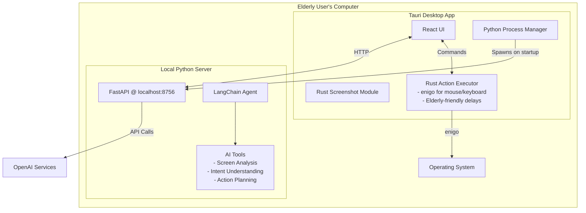

# AI Desktop Assistant for Elderly Users - MVP Technical Specification

**Project Timeline:** 1 Month MVP  
**Target User:** Elderly computer users (primary: your grandfather)  
**Core Value Prop:** Voice-controlled computer assistance with visual context

## 1. MVP Scope (What We're Building in Month 1)

### Core Features Only:

1. **Overlay Toolbar** - Simple floating window with 3 buttons max
2. **Voice Input** - Push-to-talk microphone button
3. **AI Processing** - Screenshot + voice → action commands
4. **Basic Automation** - Mouse clicks, typing, and browser navigation
5. **Safety Confirmation** - Simple yes/no prompts before actions, chat summaries of actions

### What We're NOT Building (Post-MVP):

- Complex file management
- Multi-window management
- Offline/local AI models
- Advanced accessibility features
- Cross-platform support (pick one OS first)

## 2. Technical Stack (Optimized for Speed)

### Frontend Framework: **Tauri + React**

- **Why:** Lightweight (~10MB), native performance, built-in system APIs
- **UI Library:** Mantine UI (pre-built accessible components)
- **Styling:** Tailwind CSS (rapid prototyping)

### Backend Architecture:

```
User Voice → Local Python Server → Whisper API → GPT-4 Vision → LangChain Agent → PyAutoGUI Actions
```

### Local Python Backend (NEW):

```python
# Runs on user's machine at localhost:8756
# Bundled with PyInstaller - no Python installation needed
FastAPI + LangChain + PyAutoGUI
```

### Core Dependencies:

```toml
# Cargo.toml (Rust backend)
[dependencies]
tauri = { version = "2.0", features = ["api-all"] }
screenshots = "0.8"  # Fast screen capture only
enigo = "0.2"  # Mouse/keyboard control - replaces PyAutoGUI
tokio = { version = "1", features = ["full"] }
serde = { version = "1.0", features = ["derive"] }

# requirements.txt (Python backend)
fastapi==0.104.1
uvicorn==0.24.0
langchain==0.1.0
openai==1.3.0
pillow==10.1.0
pydantic==2.5.0
python-multipart==0.0.6
# Note: PyAutoGUI removed - using Rust enigo instead
```

### Package.json (React frontend)
```json
{
  "dependencies": {
    "@tauri-apps/api": "^2.0",
    "@mantine/core": "^7.0",
    "react": "^18.2",
    "react-use": "^17.4"
  }
}
```

## 3. System Architecture

### 3.1 Process Architecture



### 3.2 Tauri Commands (Action Execution in Rust)

```rust
// Core commands exposed to frontend
#[tauri::command]
async fn capture_screenshot() -> Result<String, String>

#[tauri::command]
async fn check_python_health() -> Result<bool, String>

// Action execution commands using enigo
#[tauri::command]
async fn execute_click(x: i32, y: i32, delay_ms: u64) -> Result<String, String>

#[tauri::command]
async fn execute_type(text: String, delay_per_char_ms: u64) -> Result<String, String>

#[tauri::command]
async fn execute_scroll(direction: String, amount: i32) -> Result<String, String>

#[tauri::command]
async fn execute_key_press(key: String) -> Result<String, String>

#[tauri::command]
async fn emergency_stop() -> Result<(), String>
```

### 3.3 Python Backend Structure (AI Only, No Direct System Control)

```python
# main.py - Local FastAPI server
@app.post("/process-command")
async def process_command(request: CommandRequest) -> ActionResponse:
    # Use LangChain agent to determine what actions to take
    result = await agent.process(
        command=request.audio_text,
        screenshot=request.screenshot
    )
    # Returns JSON actions for Rust to execute
    return ActionResponse(
        actions=result.actions,  # e.g., [{"type": "click", "x": 100, "y": 200}]
        explanation=result.explanation,
        needs_confirmation=True
    )

# No execute-actions endpoint needed - Rust handles execution directly
```

### 3.4 Rust Action Executor (enigo)

```rust
// src-tauri/src/actions.rs - Elderly-friendly action execution
use enigo::{Enigo, MouseButton, Key, KeyboardControllable, MouseControllable};
use std::thread;
use std::time::Duration;

// Elderly-friendly wrapper around enigo
pub struct ElderlyActionExecutor {
    enigo: Enigo,
    default_mouse_speed: f32,  // pixels per step
    default_type_delay: u64,   // ms between keystrokes
}

impl ElderlyActionExecutor {
    pub fn new() -> Self {
        Self {
            enigo: Enigo::new(),
            default_mouse_speed: 20.0,
            default_type_delay: 100,
        }
    }
    
    // Smooth mouse movement elderly users can follow
    pub fn smooth_mouse_move(&mut self, target_x: i32, target_y: i32) {
        let (start_x, start_y) = self.enigo.mouse_location();
        let distance = ((target_x - start_x).pow(2) + (target_y - start_y).pow(2)) as f32;
        let steps = (distance.sqrt() / self.default_mouse_speed) as i32;
        
        for i in 1..=steps {
            let progress = i as f32 / steps as f32;
            let x = start_x + ((target_x - start_x) as f32 * progress) as i32;
            let y = start_y + ((target_y - start_y) as f32 * progress) as i32;
            self.enigo.mouse_move_to(x, y);
            thread::sleep(Duration::from_millis(10));
        }
    }
    
    // Type with visible delay for elderly users
    pub fn type_slowly(&mut self, text: &str, delay_ms: u64) {
        for ch in text.chars() {
            self.enigo.key_sequence(&ch.to_string());
            thread::sleep(Duration::from_millis(delay_ms));
        }
    }
}

#[tauri::command]
async fn execute_click(x: i32, y: i32, delay_ms: u64) -> Result<String, String> {
    let mut executor = ElderlyActionExecutor::new();
    
    // Visual feedback - move mouse slowly
    executor.smooth_mouse_move(x, y);
    
    // Pause before clicking so user sees where we're clicking
    thread::sleep(Duration::from_millis(delay_ms));
    
    executor.enigo.mouse_click(MouseButton::Left);
    Ok(format!("Clicked at ({}, {})", x, y))
}

#[tauri::command]
async fn execute_type(text: String, delay_per_char_ms: u64) -> Result<String, String> {
    let mut executor = ElderlyActionExecutor::new();
    executor.type_slowly(&text, delay_per_char_ms);
    Ok(format!("Typed: {}", text))
}

#[tauri::command]
async fn emergency_stop() -> Result<(), String> {
    // Move mouse to corner (failsafe position)
    let mut enigo = Enigo::new();
    enigo.mouse_move_to(0, 0);
    Ok(())
}
```

### 3.5 LangChain Agent (AI Planning Only)

## 4. External Services

### Speech-to-Text: **OpenAI Whisper API**

- **Why:** Best accuracy for elderly speech patterns, handles accents well
- **Cost:** ~$0.006/minute (negligible for personal use)
- **Implementation:** Called from Python backend

### AI Model: **GPT-4 Vision** (via OpenAI API)

- **Why:** Can understand screenshots + instructions in one call
- **LangChain System Prompt:**

```python
ELDERLY_ASSISTANT_PROMPT = """You are a helpful computer assistant for elderly users. 
Given a screenshot and voice command, help them complete their task.

IMPORTANT RULES:
1. Be extremely careful and conservative
2. Move slowly - elderly users need time to see what's happening
3. Always explain what you're about to do in simple terms
4. If unsure, ask for clarification
5. NEVER type passwords or sensitive information without explicit confirmation

Available tools:
- click(x, y): Click at screen coordinates
- type(text): Type text at current cursor
- scroll(direction, amount): Scroll up or down

Current screenshot shows what's on their screen."""
```

## 5. MVP User Interface

### Toolbar Design (React Component)

```jsx
// Simple 3-button floating toolbar
<FloatingToolbar>
  <MicButton onClick={handleVoiceInput} isRecording={isRecording} />
  <HelpButton onClick={showQuickHelp} />
  <StopButton onClick={emergencyStop} />
</FloatingToolbar>

// Confirmation Dialog with Action Details
<ConfirmDialog>
  <Text size="xl">I'm going to help you with: {command}</Text>
  <ActionList>
    {actions.map(action => (
      <ActionItem key={action.id}>
        <Icon type={action.type} />
        <Text>{action.description}</Text>
      </ActionItem>
    ))}
  </ActionList>
  <Button size="xl" color="green">Yes, do it</Button>
  <Button size="xl" color="red">No, cancel</Button>
</ConfirmDialog>
```

### Frontend Integration with Rust Actions

```typescript
// src/api.ts
export async function processAndExecute(audioText: string, screenshot: string) {
  // 1. Get AI decision from Python
  const response = await fetch(`${PYTHON_API}/process-command`, {
    method: 'POST',
    headers: { 'Content-Type': 'application/json' },
    body: JSON.stringify({ audio_text: audioText, screenshot })
  });
  
  const { actions, explanation } = await response.json();
  
  // 2. Show confirmation
  const confirmed = await showConfirmation(actions, explanation);
  
  if (confirmed) {
    // 3. Execute via Rust (not Python)
    for (const action of actions) {
      switch (action.type) {
        case 'click':
          await invoke('execute_click', { 
            x: action.x, 
            y: action.y,
            delay_ms: 500  // Elderly-friendly pause
          });
          break;
        case 'type':
          await invoke('execute_type', { 
            text: action.text,
            delay_per_char_ms: 100  // Visible typing
          });
          break;
        case 'scroll':
          await invoke('execute_scroll', {
            direction: action.direction,
            amount: action.amount
          });
          break;
      }
      
      // Pause between actions for elderly users
      await new Promise(resolve => setTimeout(resolve, 500));
    }
  }
}
```

### Accessibility Requirements (MVP):

- Minimum 48x48px touch targets
- 24pt+ font size
- High contrast colors only
- Visual + audio feedback

## 6. Development Plan (4 Weeks)

### Week 1: Foundation & Integration

- [ ] Set up Tauri project with React
- [ ] Create basic Python FastAPI server
- [ ] Implement Tauri → Python subprocess spawning
- [ ] Test localhost communication
- [ ] Create floating toolbar UI
- [ ] Implement screen capture in Rust

**Acceptance Criteria - Week 1:**
- ✓ Tauri app successfully spawns Python server on startup
- ✓ Health check endpoint returns 200 OK
- ✓ Screenshot capture works and returns base64 string
- ✓ Toolbar stays on top and is draggable

### Week 2: Voice & Basic Action Execution

- [ ] Audio recording from browser
- [ ] Whisper API integration in Python
- [ ] Implement Rust action executor with enigo
- [ ] Add smooth mouse movement for elderly visibility
- [ ] Implement type command with configurable delays
- [ ] Basic error handling and failsafe (mouse to corner)

**Acceptance Criteria - Week 2:**
- ✓ Can record 10-second audio clip
- ✓ Whisper transcribes with >90% accuracy on clear speech
- ✓ Mouse moves smoothly to target (not instant jumps)
- ✓ Clicking has 500ms pause for user confirmation
- ✓ Typing occurs at configurable speed (default 100ms/char)
- ✓ Emergency stop moves mouse to (0,0) instantly

### Week 3: AI Integration & LangChain

- [ ] GPT-4 Vision setup in LangChain
- [ ] Create elderly-optimized agent (returns JSON actions)
- [ ] Implement safety validations in Rust
- [ ] Action confirmation flow with clear descriptions
- [ ] Add scroll and key press commands
- [ ] Integration test: Python AI → Rust execution

**Acceptance Criteria - Week 3:**
- ✓ Agent correctly interprets "click the red button" and returns coordinates
- ✓ Rust safety validator prevents clicking on system areas (taskbar, close buttons)
- ✓ Confirmation dialog shows user-friendly action descriptions
- ✓ Full pipeline works: Voice → AI → Confirmation → Rust execution
- ✓ Can complete form filling with 3 fields successfully
- ✓ Response time from command to action < 3 seconds

### Week 4: Testing, Packaging & Polish

- [ ] PyInstaller bundling of Python backend
- [ ] Test 5 common elderly scenarios
- [ ] Add emergency stop functionality
- [ ] Create single installer with Tauri
- [ ] Write simple user guide with screenshots

**Acceptance Criteria - Week 4:**
- ✓ Single installer under 60MB
- ✓ App starts within 5 seconds on average PC
- ✓ Emergency stop halts all actions within 500ms
- ✓ Successfully completes all 5 test scenarios
- ✓ No Python installation required on fresh Windows

## 7. Key Technical Decisions

### Platform Priority: **Windows First**

- Most elderly users are on Windows
- Better PyAutoGUI support
- Can add macOS in v2

### Distribution Strategy:

- **Single Installer**: Bundles Tauri + Python executable
- **No Dependencies**: User doesn't need Python/Rust/anything
- **Auto-start Python**: Tauri spawns Python server automatically
- **Clean Shutdown**: Python process killed when app closes

### Security Approach:

- **Localhost Only**: Python server only accepts local connections
- **No Admin Required**: All actions in user-space
- **API Key Storage**: Encrypted in OS keychain
- **Action Confirmation**: Every action requires user approval
- **10-second Timeout**: All actions auto-cancel after timeout

### Performance Targets:

- App size: <60MB (including Python)
- Memory usage: <250MB (Tauri + Python)
- Voice response: <3 seconds total
- Action execution: <500ms per action

## 8. Testing Scenarios (MVP Must-Haves)

### Scenario 1: "Open my email"
**Steps:** Voice command → Screenshot → Navigate to Gmail
**Acceptance:** Opens gmail.com in default browser within 5 seconds

### Scenario 2: "Click the blue send button"
**Steps:** Voice command → Identify blue button → Click
**Acceptance:** Correctly identifies and clicks button 9/10 times

### Scenario 3: "Type my name is John"
**Steps:** Voice command → Type in current field
**Acceptance:** Types slowly and accurately, visible to user

### Scenario 4: "Make the text bigger"
**Steps:** Voice command → Execute Ctrl+Plus
**Acceptance:** Zooms in on current webpage/document

### Scenario 5: "Stop stop stop"
**Steps:** Emergency command → Halt all actions
**Acceptance:** Stops within 500ms, shows "Stopped" message

## 9. Packaging & Distribution

### Build Process:

```bash
# Step 1: Bundle Python backend (smaller without PyAutoGUI)
cd python-backend
pyinstaller --onefile \
  --hidden-import=langchain \
  --hidden-import=openai \
  --hidden-import=pydantic \
  --add-data "templates;templates" \
  main.py

# Step 2: Build Tauri with Python included
cd ..
npm run tauri build

# Output: ElderlyAssistant-Setup-1.0.0.exe (~45-50MB)
```

### What Users Get:

- Single .exe installer (Windows)
- No Python needed
- No dependencies required
- Smooth, elderly-friendly mouse movements
- Fast, responsive action execution
- Desktop shortcut created
- Starts with Windows (optional)

## 10. Post-MVP Roadmap

**Month 2:**
- Chat history window
- More action types (file operations)
- Local Whisper model option
- macOS support

**Month 3:**
- Advanced browser automation
- Voice profiles for better recognition
- Undo functionality
- Multi-step macros

**Future:**
- Fully offline mode with local LLMs
- Plugin system for custom tools
- Multi-language support
- Mobile app companion

## Success Metrics

- **Primary:** Grandfather can complete 3 daily tasks without calling for help
  - ✓ Check email
  - ✓ Read news website
  - ✓ Fill simple web form
  
- **Secondary:** <5 seconds from voice command to action completion
  - Measured from end of speech to action execution
  
- **Tertiary:** Zero critical errors in first week of use
  - No system crashes
  - No accidental deletions
  - No security warnings

## Key Architecture Benefits

### Why Rust + enigo for Actions:

1. **Performance**: 10-100x faster than PyAutoGUI
   - Click execution: ~1ms vs 100ms
   - No Python interpreter overhead for actions

2. **Smooth Animations**: Native control allows 60fps mouse movement
   - Elderly users can follow the cursor
   - More professional feel

3. **Better Error Handling**: Rust's type system prevents crashes
   - No Python exceptions during critical actions
   - Guaranteed cleanup on failures

4. **Smaller Package**: ~10MB less without PyAutoGUI
   - Faster downloads for elderly users
   - Less disk space required

5. **Direct Control**: No IPC overhead for actions
   - Rust directly controls mouse/keyboard
   - Python only makes AI decisions

### Architecture Summary:

```
User Voice → Tauri (Rust) → Python (AI Decision) → Tauri (Rust Execution)
                ↑                                           ↓
            Screenshot                                   enigo Actions
```

This hybrid approach gives you the best of both worlds:
- **Python/LangChain** for powerful AI orchestration
- **Rust/enigo** for fast, reliable system control
- **Clear separation** between intelligence and execution

---

**Remember:** This is an MVP. Focus on making 5 things work perfectly rather than 50 things work poorly. Your grandfather's most common computer tasks should drive priority.