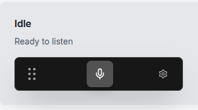
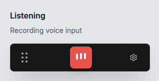
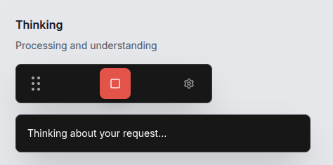
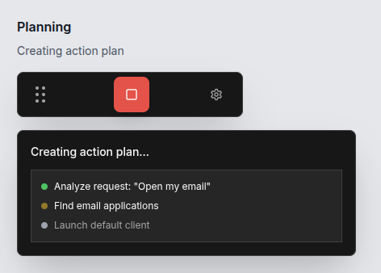
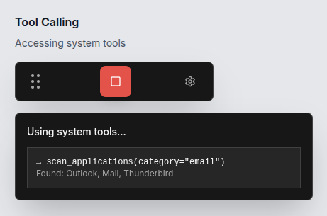
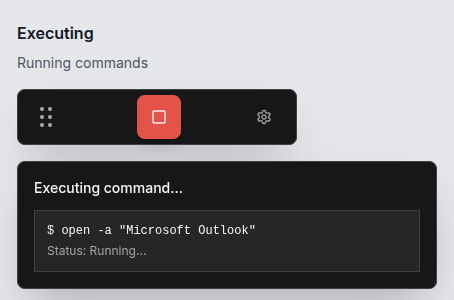
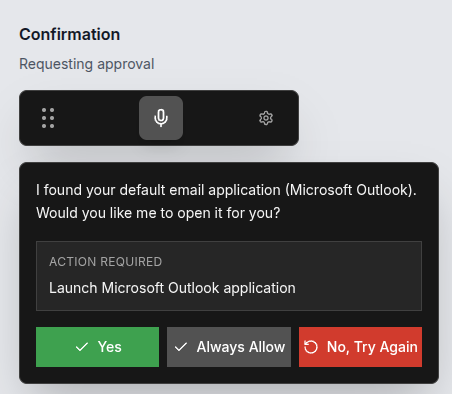
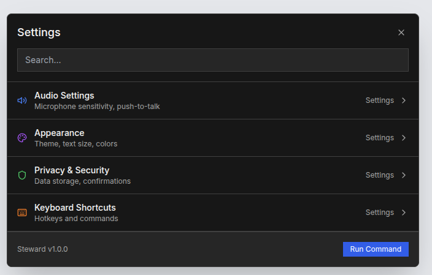

# Steward AI Desktop Assistant MVP Technical Specification

### Core Features Only:

1. **Overlay Toolbar** - Simple floating window with 3 buttons max
2. **Voice Input** - Push-to-talk microphone button
3. **AI Processing** - Screenshot + voice → action commands
4. **Basic Automation** - Mouse clicks, typing, and browser navigation
5. **Safety Confirmation** - Simple yes/no prompts before actions, chat summaries of actions

## 2. Technical Stack

- Tauri 2.0
- React
- TailwindCSS
- Headless UI
- Rust `enigo` library for desktop actions
- Python FASTAPI + Langchain for AI related development (setup as a sidecar)
- SQLite for local session storage
- JSONL for conversation summaries


## 3. System Architecture

### Architecture Summary:

```
User Voice → Tauri (Rust) → Python (AI Decision) → Tauri (Rust Execution)
                ↑                                           ↓
            Screenshot                                   enigo Actions
                ↓                                           ↓
            SQLite Storage                            Action History
```

### Data Storage:
- Local SQLite database for session history
- JSONL files for conversation summaries
- Screenshots stored as blobs with 7-day retention
- Project context via CLAUDE.md-style files


## 4. UI Design

Raycast / Command Palette inspired design. **IMPORTANT**: These are conceptual and for inspiration, the final design may not look the same

### Color Themes
We will support out-of-the-box color themes optimized for elderly users with high contrast and large text.

| Theme | Primary | Secondary | Accent | Text | Text Secondary | Border |
|-------|---------|-----------|--------|------|----------------|---------|
| **Dark Grayscale** | #171717 | #262626 | #525252 | #f5f5f5 | #a3a3a3 | #404040 |
| **Warm Charcoal** | #1c1917 | #292524 | #d97706 | #fafaf9 | #a8a29e | #44403c |
| **Deep Blue** | #0f172a | #1e293b | #3b82f6 | #f1f5f9 | #94a3b8 | #334155 |
| **Forest Green** | #064e3b | #065f46 | #10b981 | #ecfdf5 | #6ee7b7 | #047857 |
| **Midnight Purple** | #581c87 | #6b21a8 | #a855f7 | #faf5ff | #c4b5fd | #7c3aed |
| **Coffee Brown** | #451a03 | #78350f | #f97316 | #fffbeb | #fcd34d | #92400e |
| **Ocean Teal** | #042f2e | #134e4a | #2dd4bf | #f0fdfa | #5eead4 | #115e59 |
| **Light Mode** | #ffffff | #f9fafb | #2563eb | #111827 | #4b5563 | #e5e7eb |

### Agent Flow Mockups








### Settings Page Mockup


## Testing Scenarios (MVP Must-Haves)

### Scenario 1: "Open my email"
**Steps:** Voice command → Screenshot → Navigate to Gmail
**Acceptance:** Opens gmail.com in default browser within 5 seconds

### Scenario 2: "Click the blue send button"
**Steps:** Voice command → Identify blue button → Click
**Acceptance:** Correctly identifies and clicks button 9/10 times

### Scenario 3: "Type my name is John"
**Steps:** Voice command → Type in current field
**Acceptance:** Types slowly and accurately, visible to user

### Scenario 4: "Make the text bigger"
**Steps:** Voice command → Execute Ctrl+Plus
**Acceptance:** Zooms in on current webpage/document